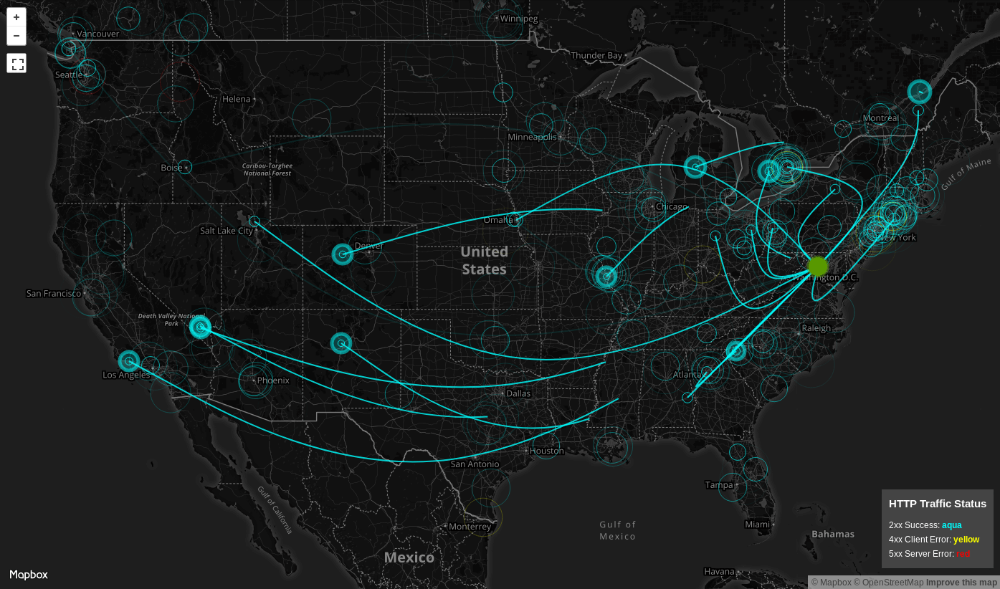

# AccessViz

Specter is an attack map style visualization that parses NGINX access logs. Specter then displays the source ip's location, the NGINX's ip's location, and the http status on a world map. Additionally allows filtering the traffic based on services. 

## License

This project is licensed under the MIT License - see the [LICENSE.md](LICENSE.md) file for details.
